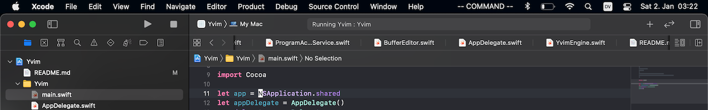

#  Yvim

Yvim uses macOS accessibility APIs to add Vim-inspired keyboard commands to Xcode.

### Commands

* Insert text before `i` or after the cursor `a`.

* Paste text that was deleted or yanked `p`.

* Delete `d` + `{motion}` or yank text `y` + `{motion}`.

* Enter visual mode `v`.

### Motions

* Move the cursor one step `h`, `l`, `j`, `k`, or multiple steps at once `{n}` + `h`, `l`, `j`, `k`.

* Jump to the beginning `0` or end `$` of a line, or to the first non-space character `^`.

* Find a character after the cursor `f` + `{char}`, or move forward upto a character `t` + `{char}`, or in reverse `F` + `{char}`, `T` + `{char}`.

## How to run

* Change to a block cursor style in Xcode in Preferences in the Themes tab.
* Launch Yvim.
* Give Yvim the "Accessibility" and "Input monitoring" permissions in System Preferences.

Yvim does not affect any apps other than Xcode.

## Compatibility

Yvim has been tested to work with macOS Big Sur and Xcode 12.
