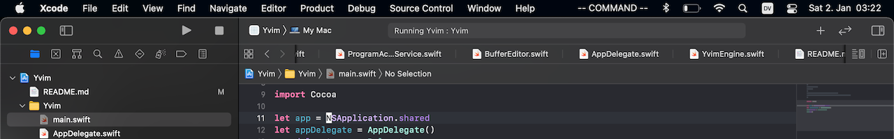
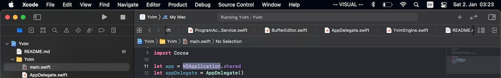
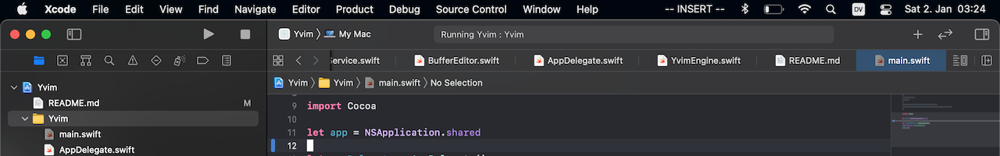

*This is a work in progress!*

#  Yvim

Yvim uses macOS accessibility APIs to add Vim-inspired keyboard commands to Xcode.

#### Command mode

Move the cursor `h`, `l`, `j`, `k`, optionally multiple steps at once `{n}` + `h`, `l`, `j`, `k`.

Jump to the beginning `0` or end `$` of a line, or to the first non-space character `^`.

Find the first occurrence of a character after the cursor `f` + `{char}`.

Paste text that was deleted or yanked in visual mode `p`.

Insert text before `i` or after the cursor `a`.

Enter visual mode `v`.

#### Visual mode

Change the selection `h`, `l`, `j`, `k`.

Delete the selection `d` or yank it `y`.

#### Insert mode

Any key or key combination is sent through to Xcode.

Use `esc` to go back to command mode.

## How to run

* Change to a block cursor style in Xcode in Preferences in the Themes tab.
* Launch Yvim.
* Give Yvim the "Accessibility" and "Input monitoring" permissions in System Preferences.

Yvim does not affect any apps other than Xcode.

## Compatibility

Yvim has been tested to work with macOS Big Sur and Xcode 12.
